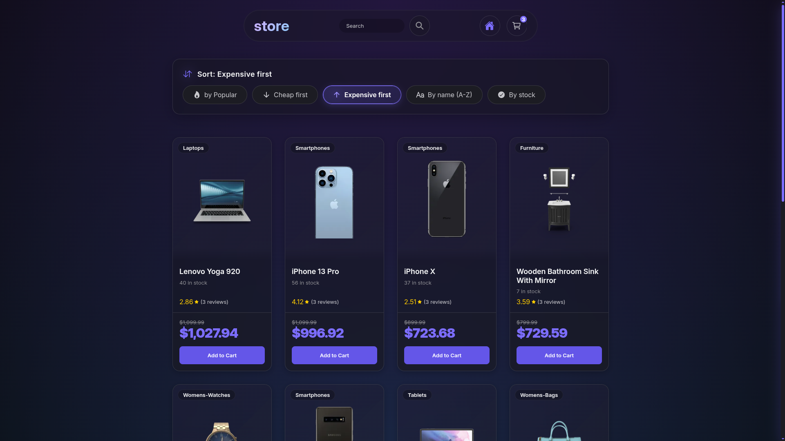
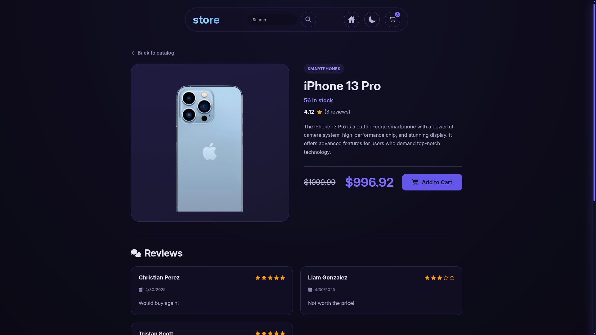
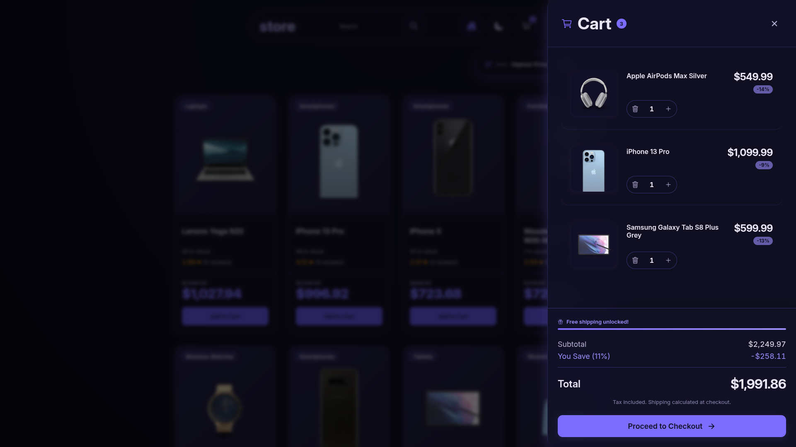
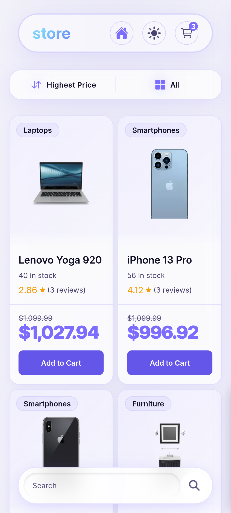

<div align="center">


<br/>

<h1>🛍️ Store</h1>

<p align="center">
  <em>A modern, feature-rich e-commerce storefront</em>
</p>

<br/>

<p align="center">
  <a href="https://react.dev/">
    
  </a>
  
  <a href="https://www.typescriptlang.org/">
    
  </a>
  
  <a href="https://redux-toolkit.js.org/">
    
  </a>
  
  <a href="https://vitejs.dev/">
    
  </a>
  
  <a href="https://sass-lang.com/">
    
  </a>
</p>

<br/>

<p align="center">
  
  
  
  
  
</p>

<br/>

> A fully responsive, dark-themed e-commerce UI with glassmorphism aesthetics, real-time search, smart pagination, and a Redux-powered shopping cart — built as a portfolio project to demonstrate modern React architecture.

<br/>


<br/>


</div>

<br/>

## ✨ Features

| | Feature | Description |
|:---:|---|---|
| 🔍 | **Instant Product Search** | Instant URL-synced search powered by query params — results are always shareable and bookmarkable |
| 🗂️ | **Dynamic Product Catalog** | Paginated grid fetched from [DummyJSON](https://dummyjson.com) with normalized state via RTK Query |
| ↕️ | **Advanced Sorting** | Sort by popularity, price, name, or stock level — persisted in the URL |
| 📄 | **Detailed Product Pages** | Routed pages (`/product/:id`) with full description, image, stock status, ratings, and reviews |
| 🛒 | **Redux Shopping Cart** | Client-side cart with add/remove, quantity controls, discount calculation, and free-shipping progress bar |
| 📱 | **Responsive & Mobile-First** | Adaptive layout for all screen sizes; mobile gets a floating search bar with hide-on-scroll behavior |
| 💎 | **Glassmorphism UI** | Dark theme built on a custom SCSS design token system with consistent spacing, shadows, and blur effects |
| ⚡ | **Performance Optimizations** | Lazy routes, memoized selectors via Reselect, normalized API cache, and image lazy loading |

<br/>

## 🛠️ Tech Stack

<div align="center">

| Category | Technology |
|:---|:---|
| **UI Library** | React 19 |
| **Language** | TypeScript 5.9 |
| **State Management** | Redux Toolkit 2.9 + RTK Query |
| **Routing** | React Router v7 |
| **Styling** | SCSS Modules + custom design tokens |
| **HTTP Client** | RTK Query base query |
| **Build Tool** | Vite 7 |
| **Data Source** | [DummyJSON API](https://dummyjson.com) |

</div>

<br/>

## 🏗️ Project Architecture

The project follows a **feature-based architecture** with clean separation of concerns:

```
src/
├── app/
│   ├── router.ts          # React Router v7 configuration with lazy routes
│   └── store.ts           # Redux store setup
│
├── components/
│   ├── cart/              # CartDrawer, CartItem, CartFooter, EmptyCart
│   ├── common/            # Loader, ErrorView, NoResults, SearchForm
│   ├── layout/            # Layout, Navbar, MobileBar
│   └── products/          # ProductCard, SortPanel, Pagination
│
├── hooks/                 # Custom hooks encapsulating business logic
│   ├── useProductCatalog  # Orchestrates fetching, sorting, pagination
│   ├── useProduct         # Single product fetch with RTK Query
│   ├── useSearch          # URL-synced search state
│   ├── useSort            # URL-synced sort state
│   ├── useUrlPagination   # URL-synced pagination
│   ├── usePagination      # Smart pagination range with ellipsis logic
│   ├── useNavbarScroll    # Scroll-aware navbar class toggling
│   └── useMediaQuery      # Responsive breakpoint detection
│
├── pages/
│   ├── CatalogPage/       # Main product grid
│   ├── ProductPage/       # Individual product detail
│   └── Page404/           # Not found fallback
│
├── services/
│   └── productsApi.ts     # RTK Query API slice (getProducts, getProductById)
│
├── store/
│   ├── slices/cartSlice   # Cart state: items, open/close, quantity
│   └── selectors/         # Memoized cart selectors (total, quantity, items)
│
├── styles/
│   ├── _variables.scss    # Full design token system
│   ├── index.scss         # SCSS barrel file
│   └── main.scss          # Global resets & base styles
│
├── types/
│   └── products.ts        # TypeScript interfaces (Product, CartItem, Review…)
│
└── utils/
    ├── priceHelper        # applyDiscount, formatPrice
    ├── cartHelper         # calculateCartTotals (subtotal, discount, shipping)
    ├── sortingOptions     # Typed sorting config array
    ├── getErrorMessage    # RTK Query error normalizer
    └── scrollToTop        # Scroll utility
```

### Key Architectural Decisions

**🔗 URL as the single source of truth for UI state** — search query (`?q=`), sort (`?sortBy=`, `?order=`), and page (`?page=`) are all URL params. Makes the app fully shareable and back/forward navigation works correctly out of the box.

**⚡ Normalized API cache** — RTK Query responses are transformed into `{ ids: number[], items: Record<id, Product> }` for O(1) lookups and clean re-renders.

**🧩 Custom hooks as the logic layer** — Components stay declarative and thin; all data fetching, URL manipulation, and derived state live in dedicated hooks.

**🎨 SCSS design token system** — All colors, spacing, radius, shadows, transitions, and z-indexes are defined in `_variables.scss`, ensuring consistency and making visual changes a one-line update.

<br/>

## 🚀 Getting Started

### Prerequisites

- Node.js `>= 20`
- [pnpm](https://pnpm.io/) _(recommended)_ or npm

### Installation

```bash
# Clone the repository
git clone https://github.com/your-username/store.git
cd store

# Install dependencies
pnpm install

# Start the development server
pnpm dev
```

The app will be available at `http://localhost:5173`

### Available Scripts

```bash
pnpm dev        # Start dev server with HMR
pnpm build      # Type-check + production build
pnpm preview    # Preview the production build locally
pnpm lint       # Run ESLint
pnpm tsc        # Run TypeScript type checking only
```

<br/>

## 📐 Design System

The UI is built on a custom SCSS token system covering every visual dimension:

<div align="center">

| Token Category | Examples |
|:---|:---|
| **Colors** | `$primary-accent`, `$text-primary`, `$glass-background` |
| **Typography** | `$fs-sm` → `$fs-display` · `$fw-normal` → `$fw-black` |
| **Spacing** | `$spacing-xxs` (0.25rem) → `$spacing-xxl` (3rem) |
| **Border Radius** | `$radius-sm` (8px) → `$radius-pill` (999px) |
| **Shadows** | `$shadow-xs` → `$shadow-accent-hover` |
| **Transitions** | `$transition-fast` (200ms) → `$transition-smooth` (600ms) |
| **Easing** | `$ease-spring` · `$ease-out-expo` · `$ease-in-out-smooth` |
| **Z-Index** | Hierarchical from `$z-index-base` to `$z-index-toast` |

</div>

<br/>

## 🔌 API Integration

All data is sourced from the **[DummyJSON API](https://dummyjson.com)** — a free, public REST API for prototyping.

<div align="center">

| Endpoint | Usage |
|:---|:---|
| `GET /products` | Paginated catalog with sort support |
| `GET /products/search?q=` | Real-time search results |
| `GET /products/:id` | Product detail page |

</div>

RTK Query handles caching, loading states, and deduplication automatically. Responses are normalized in `transformResponse` before hitting the Redux store.

<br/>

## 📸 Screenshots

<div align="center">

| Catalog Page | Product Page |
|:---:|:---:|
|  |  |

| Shopping Cart |
|:---:|
|  |

| Mobile View |
|:---:|
|  |

</div>

<br/>

## 🗺️ Roadmap

- [ ] Product category filtering
- [ ] Wishlist / saved items feature
- [ ] Persistent cart via `localStorage`
- [ ] Checkout flow (UI-only)
- [ ] Unit tests with Vitest + React Testing Library

<br/>

## 📄 License

This project is open source and available under the [MIT License](LICENSE).

<br/>

<div align="center">


<sub>Made with ☕ and a lot of <code>git commit -m "ship it"</code></sub>

</div>
