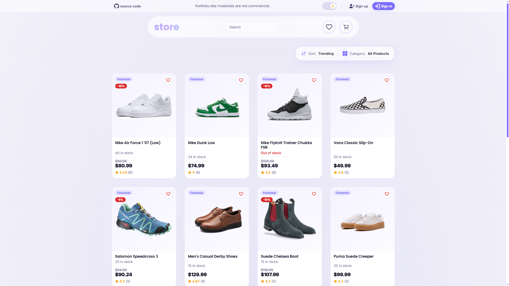
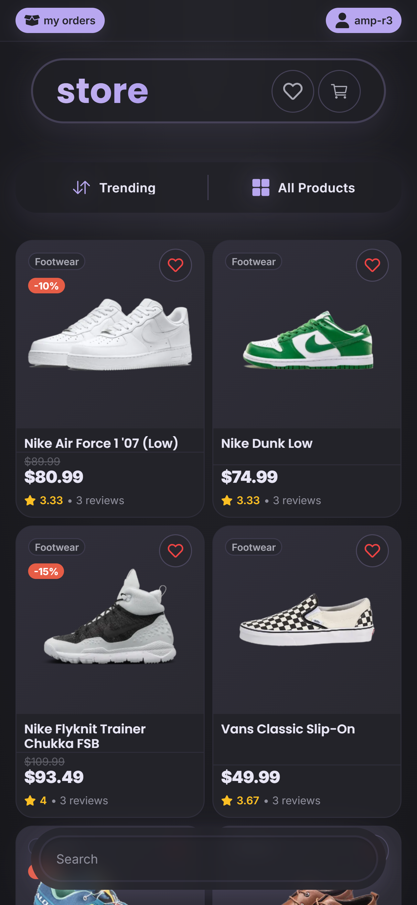
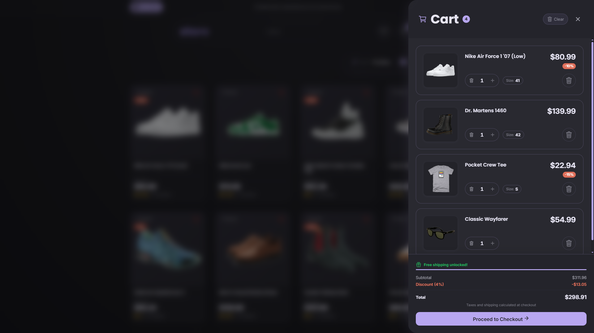
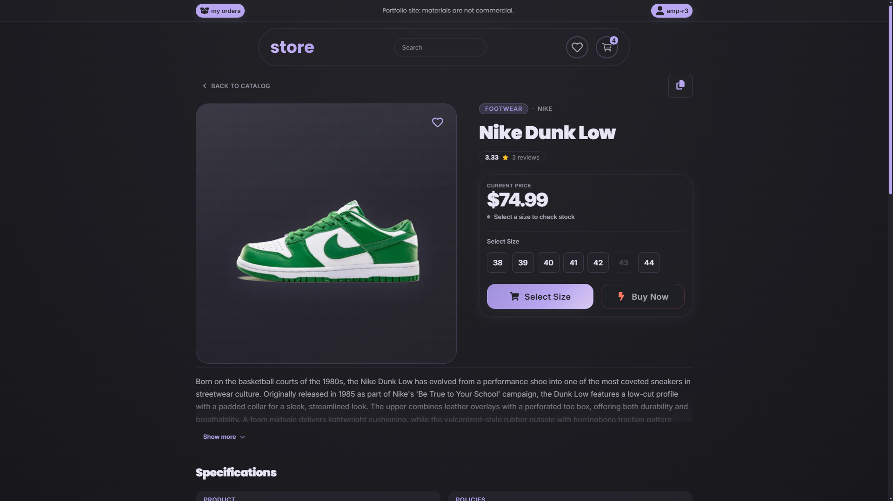

<p align="right">
  <a href="README.md">English</a> | <a href="README.ru.md">Русский</a>
</p>

# 🛍️ Store — E-Commerce Platform

_A modern, premium, high-tech online store — portfolio project._

**Live demo:** [store-mauve-nine.vercel.app](https://store-mauve-nine.vercel.app/)

**Store** is a full-stack e-commerce application built with **Next.js 16**
(App Router, Turbopack), **React 19**, **TypeScript 5.9**, and **Redux
Toolkit 2.9**. It features a premium **Glassmorphism** design, a custom
Lavender & Graphite theme, URL-synced catalog state, a responsive mobile
layout, haptic feedback, product reviews, realtime notifications, a full
store-management admin panel, and deep **Supabase** integration for
authentication, cart persistence, wishlists, and order history.

**Stack:** Next.js 16 (App Router, Turbopack) · React 19 · TypeScript 5.9 ·
Redux Toolkit 2.9 + RTK Query · redux-persist · Supabase (PostgreSQL + Auth
via `@supabase/ssr`) · SCSS Modules · React Hook Form + Zod

---

## 🏗️ Project Architecture (Feature-Sliced Design)

The project is architected using the **Feature-Sliced Design (FSD)** methodology on top of the Next.js App Router, providing a strict, predictable, scalable structure with a strong emphasis on separation of concerns, modularity, and adherence to naming conventions (BEM, SCSS Modules).

```text
app/              # Next.js App Router: routes, layouts, route guards, Server Actions
src/
├── app/            # Store setup, providers, global styles (FSD "app" layer)
├── views/          # Page compositions (CatalogPage, ProductPage, admin pages, etc.)
├── widgets/        # Complex standalone UI blocks composed of entities and features (e.g., Header, CartDrawer)
├── features/       # User interactions and business actions (e.g., cart-actions, checkout-process)
├── entities/       # Business entities and their representations (Product, User, Order, Review, Notification)
└── shared/         # Reusable infrastructure, UI kit, configs, types, utils, and base API
```

### Key Architectural Decisions

1. **Feature-Sliced Design (FSD)**: Strict adherence to FSD principles, mechanically enforced by ESLint's `no-restricted-imports`.
   - **Unidirectional dependencies**: `views` -> `widgets` -> `features` -> `entities` -> `shared`. Modules only import from layers strictly below them.
   - **Public APIs**: Every slice exposes its capabilities via an `index.ts` barrel file. Internal cross-slice imports are forbidden.
2. **Deliberate rendering strategy per route**: `/` and `/product/[id]` are
   statically generated with ISR (hourly revalidation, plus on-demand
   revalidation on mutation); `/catalog` is server-rendered for first paint
   with client-side filtering; `/user/*`, `/checkout/*`, `/admin/*` are
   fully client-rendered behind auth guards. `proxy.ts` (the App Router's
   middleware) refreshes the Supabase session cookie and redirects
   unauthenticated visitors on every request.
3. **URL as the Single Source of Truth for the catalog**: Search query (`?q=`),
   sort order (`?sortBy=`), and category (`?category=`) are all managed exclusively
   via URL (`useSearchParams`/`searchParams`). This enables shareable and
   bookmarkable links, as well as correct browser Back/Forward navigation.
4. **Thin components with logic separated into models/hooks**: All UI components are declarative.
   API requests, router manipulation, derived state computation, and validation
   are handled inside dedicated slice segments (e.g., `model`, `lib`, `api`).
5. **Normalized cache in RTK Query**: API responses are transformed into a
   `{ ids: number[], items: Record<number, Product> }` structure for O(1)
   lookups and reduced rendering overhead.
6. **Selective LocalStorage caching (Redux Persist)**: Only the most critical
   data is persisted per-slice: `cart.items`, `wishlist.favoriteItems`,
   `checkout.items`/`draft`, and `auth.user` (the Supabase session itself
   lives in an httpOnly cookie, never localStorage). RTK Query cache and
   transient UI state are not persisted.

---

## 💎 Key Features & Highlights

- 🎨 **Premium Glassmorphism & Lavender-Graphite Design**: A carefully curated Lavender & Graphite color palette,
  backdrop-filter blur, soft shadows, and smooth spring-physics-based
  micro-animations.
- ⭐ **Product Reviews**: Ratings tied to verified purchase history, a
  distribution histogram, sortable/filterable paginated review lists,
  optimistic like toggling, and a "My Reviews" page tracking both written
  and pending (unreviewed purchase) reviews.
- 🔔 **Realtime Notifications**: A notification center with unread badges,
  realtime sync via Supabase subscriptions, and triggers for order status
  changes, review replies, and wishlist price drops — separate from
  transient toast feedback for immediate actions (add-to-cart, filter
  changes).
- 🧾 **Checkout as a Vertical Accordion**: A multi-step contacts → shipping →
  payment flow with masked phone/postal inputs, autosaved drafts, prefill
  from the last order, and a confetti celebration on success.
- ⚡ **Optimistic Updates**: When updating cart quantities or toggling wishlist
  items, the UI responds instantly. Changes are sent to the server in the
  background, and automatically rolled back (`patchResult.undo()`) on failure.
- 📳 **Haptic Feedback**: Integration with the `web-haptics` library for
  pleasant vibration on mobile when adding to cart (`soft()`), changing filters
  (`light()`), or completing a purchase (`success()`).
- 🔍 **SEO & Core Web Vitals**: Server-rendered/ISR product and catalog
  pages, a dynamic sitemap and OG image generation, and `noindex` on private
  sections (`/user`, `/checkout`, `/admin`).
- ⚙️ **Strict BEM Methodology**: CSS classes are written strictly following BEM
  (`block__element--modifier`) and imported into JSX exclusively via typed SCSS
  Modules: `className={style['cart-item__btn--remove']}`.
- 🔄 **Two-stage Cart & Wishlist Sync**: Authenticated users work with the
  Supabase cloud database. On login, the local cart and wishlist from
  `localStorage` are merged with the server state (merge-on-login), preventing
  any loss of selected items.

---

## 🔌 Backend (Supabase)

Auth, product catalog, cart, wishlist, reviews, notifications, and orders
are backed by a **Supabase/PostgreSQL** schema secured end-to-end with **Row
Level Security**: each user can only read/write their own `cart_items`,
`wishlist_items`, `product_reviews`, `notifications`, and `orders` rows.
Order placement goes through a single `create_order` RPC (`SECURITY
DEFINER`) that validates the caller, resolves delivery/payment fees
server-side, and inserts the order and its line items in one transaction —
so a checkout can't leave partial state on failure. Order status history is
recorded and drives realtime notifications; product ratings are cached and
kept in sync via triggers.

---

## 🛠️ Admin Panel

A full store-management admin panel lives at `/admin`, gated server-side (in
`admin/layout.tsx`) and by an `is_admin()` RLS helper reading a `role`
column on `profiles` (default `'user'`) rather than a Supabase Auth Hook.
Admin-only writes go through `SECURITY DEFINER` RPCs that check `is_admin()`
themselves, never a role-gated table policy — `orders`/`order_items` keep
zero write policies by design.

It covers:

- **Dashboard**: order/revenue/customer counters and analytics panels.
- **Orders**: list, filter by status, search by order number, change
  payment/delivery status via `admin_update_order_status`.
- **Products**: full create/edit forms with image upload, size/stock
  management, and a before/after diff confirmation before saving.
- **Categories**: category management.
- **Low stock**: a dedicated screen for products nearing stockout.
- **Customers**: list, role management, and a details drawer with
  per-customer audit history.
- **Reviews**: moderation queue for product reviews.
- **Finance**: revenue breakdown and analytics charts (line, bar, donut).
- **Audit log**: a feed of admin actions across the panel.
- **Settings**: delivery and payment method configuration.

There is no signup flow for admins — grant the role once, manually, against
your own account:

```sql
-- run once via the Supabase SQL editor or psql "$DATABASE_URL"
update public.profiles p
set role = 'admin'
from auth.users u
where u.id = p.id
  and lower(u.email) = lower('you@example.com');
```

`profiles` has no email column (it lives on `auth.users`), which is why this
can't be done from the client — sign out and back in afterwards so the new
session picks up the role.

---

## 🔭 Planned Improvements

- **i18n** (Russian/English) via `next-intl`
- **Unit/E2E tests** (Vitest + Testing Library, Playwright)
- **Payment provider integration** (currently order placement only)

---

## 📸 UI Gallery

<div align="center">

  <div style="display: inline-block; margin: 10px; vertical-align: top;">
    <p>Catalog Page (Main)</p>
    
  </div>
  <div style="display: inline-block; margin: 10px; vertical-align: top;">
    <p>Mobile View</p>
    
  </div>

  <br><br>

  <div style="display: inline-block; margin: 10px; vertical-align: top;">
    <p>Interactive Cart</p>
    
  </div>
  <div style="display: inline-block; margin: 10px; vertical-align: top;">
    <p>Product Detail Page</p>
    
  </div>

</div>
